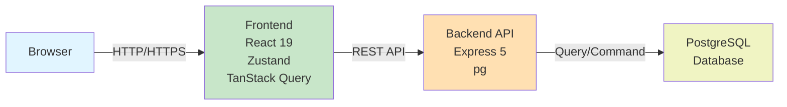
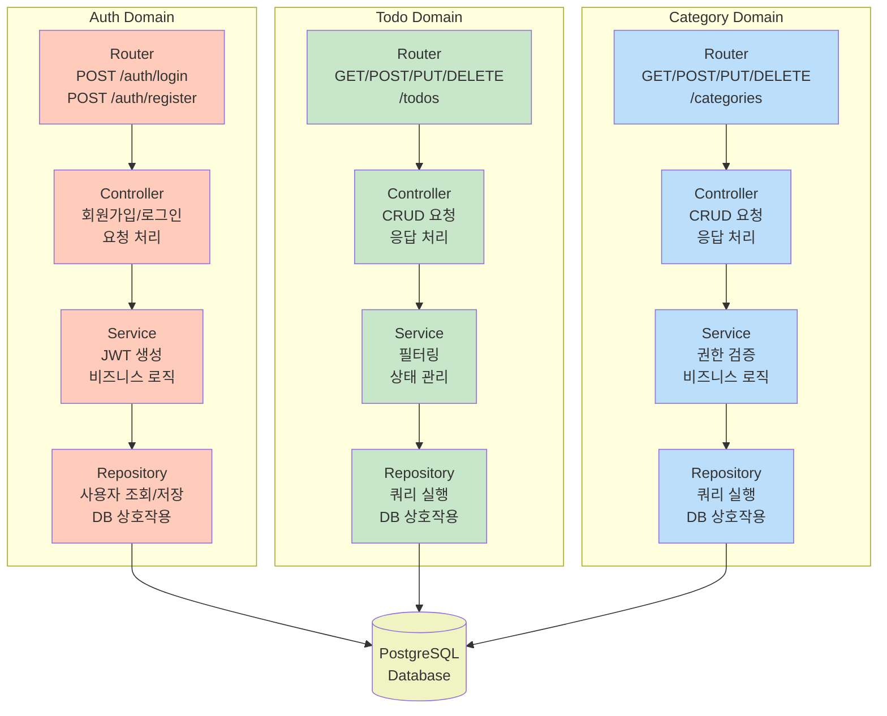
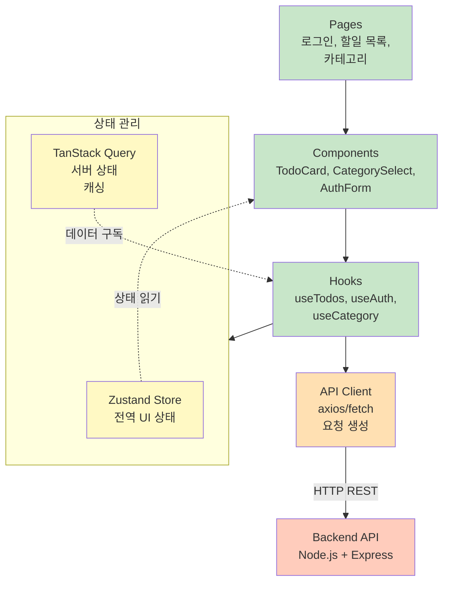
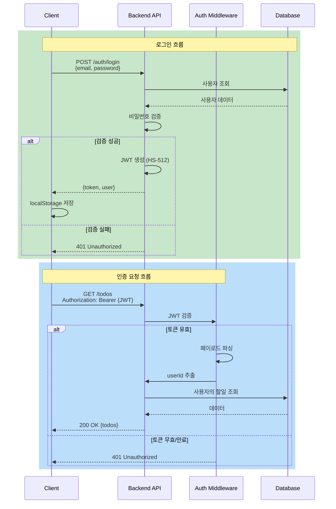

# TodoList 기술 아키텍처 다이어그램

**버전:** 1.0.0  
**작성일:** 2026-04-28  
**참조 문서:** PRD v1.0.0, 프로젝트 구조 설계 원칙 v1.1.0

---

## 변경 이력
| 버전 | 날짜 | 변경 유형 | 변경 내용 | 작성자 |
|------|------|-----------|-----------|--------|
| 1.0.0 | 2026-04-28 | 최초 작성 | 아키텍처 다이어그램 초안 작성 | Software Architect |

---

## 1. 시스템 전체 구조

---

## 2. 백엔드 레이어 구조

---

## 3. 프론트엔드 레이어 구조

---

## 4. 인증 흐름

---

## 기술 스택 요약

| 계층 | 기술 | 버전 | 역할 |
|------|------|------|------|
| **Frontend** | React | 19 | UI 렌더링 |
| | Zustand | - | 전역 UI 상태 관리 |
| | TanStack Query | - | 서버 상태 캐싱 |
| | Tailwind CSS | - | 반응형 스타일링 |
| **Backend** | Node.js | 24 | 런타임 |
| | Express | 5 | HTTP 서버 |
| | pg | - | PostgreSQL 드라이버 |
| **Database** | PostgreSQL | - | 데이터 저장소 |
| **보안** | JWT | HS-512 | 인증 토큰 |

---

## 주요 설계 원칙

1. **3-Tier 아키텍처**: Frontend / Backend / Database 명확한 분리
2. **단방향 의존성**: 각 레이어 간 단방향 흐름으로 복잡도 최소화
3. **도메인 분리**: Auth / Todo / Category 독립적 관리
4. **상태 분리**:
   - **Zustand**: UI 상태 (팝업, 로딩 중 표시 등)
   - **TanStack Query**: 서버 상태 (API 데이터)
5. **JWT 기반 인증**: Stateless 인증으로 확장성 확보
