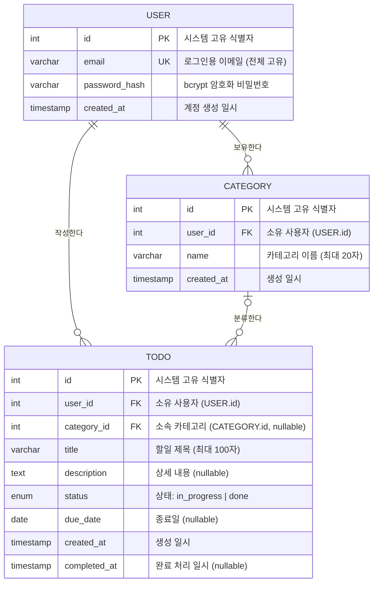

# TodoList 데이터베이스 ERD

**버전:** 1.0.0  
**작성일:** 2026-04-28  
**참조 문서:** PRD v1.0.0, 도메인 정의 v1.0.0

---

## 변경 이력

| 버전 | 날짜 | 변경 유형 | 변경 내용 | 작성자 |
|------|------|-----------|-----------|--------|
| 1.0.0 | 2026-04-28 | 최초 작성 | ERD 초안 작성 | Database Designer |

---

## 1. ERD 다이어그램

---

## 2. 엔티티 설명 표

### USER (사용자)

| 속성 | 타입 | 제약조건 | 설명 |
|------|------|----------|------|
| id | int | PK, NOT NULL, AUTO INCREMENT | 시스템 내 고유 식별자 |
| email | varchar(255) | UK, NOT NULL | 로그인 및 식별용 이메일, 시스템 전체 고유 |
| password_hash | varchar(255) | NOT NULL | bcrypt로 암호화된 비밀번호 |
| created_at | timestamp | NOT NULL, DEFAULT now() | 계정 생성 일시 |

### CATEGORY (카테고리)

| 속성 | 타입 | 제약조건 | 설명 |
|------|------|----------|------|
| id | int | PK, NOT NULL, AUTO INCREMENT | 시스템 내 고유 식별자 |
| user_id | int | FK → USER.id, NOT NULL | 카테고리 소유 사용자 |
| name | varchar(20) | NOT NULL | 카테고리 이름, 동일 사용자 내 고유 (복합 UK) |
| created_at | timestamp | NOT NULL, DEFAULT now() | 카테고리 생성 일시 |

### TODO (할일)

| 속성 | 타입 | 제약조건 | 설명 |
|------|------|----------|------|
| id | int | PK, NOT NULL, AUTO INCREMENT | 시스템 내 고유 식별자 |
| user_id | int | FK → USER.id, NOT NULL | 할일 소유 사용자 |
| category_id | int | FK → CATEGORY.id, NULL 허용 | 소속 카테고리, 카테고리 미지정 또는 삭제 시 NULL |
| title | varchar(100) | NOT NULL | 할일 제목, 최대 100자 |
| description | text | NULL 허용 | 할일 상세 내용 |
| status | enum | NOT NULL, DEFAULT 'in_progress' | 상태값: `in_progress` 또는 `done` |
| due_date | date | NULL 허용 | 할일 종료 목표일 |
| created_at | timestamp | NOT NULL, DEFAULT now() | 할일 생성 일시 |
| completed_at | timestamp | NULL 허용 | 완료 처리 일시, 완료 시 기록 / 진행 중 전환 시 NULL 초기화 |

---

## 3. 관계 설명

### USER - CATEGORY (1 : N)

한 사용자(USER)는 최대 20개의 카테고리(CATEGORY)를 보유할 수 있다. 카테고리는 반드시 특정 사용자에게 귀속되며, `category.user_id`가 반드시 존재하는 사용자를 참조해야 한다. 사용자가 삭제되면 해당 사용자의 모든 카테고리도 함께 삭제된다(CASCADE). 카테고리 접근 시에는 `user_id`를 통해 소유권을 항상 검증하여 타 사용자의 카테고리에 접근하는 것을 방지한다.

### USER - TODO (1 : N)

한 사용자(USER)는 여러 개의 할일(TODO)을 작성할 수 있다. 모든 할일은 반드시 소유 사용자를 지정해야 하므로 `todo.user_id`는 NOT NULL이다. 사용자가 삭제되면 해당 사용자의 모든 할일도 함께 삭제된다(CASCADE). 할일 조회 및 수정 시 `todo.user_id`를 이용한 소유권 검증을 필수로 수행하여 사용자 간 데이터 격리를 보장한다.

### CATEGORY - TODO (0..1 : N)

할일(TODO)은 카테고리(CATEGORY)에 선택적으로 속할 수 있다. `todo.category_id`는 NULL을 허용하여 카테고리 없이 할일을 생성할 수 있도록 지원한다. 카테고리가 삭제될 경우 해당 카테고리에 속해 있던 모든 할일의 `category_id`는 NULL로 전환된다(SET NULL). 이로써 카테고리 삭제 시에도 할일 데이터는 보존되며, 미분류 상태로 유지된다.

---

## 4. DB 제약조건 목록

### 유니크 제약 (UNIQUE)

| 제약 이름 | 대상 테이블 | 대상 컬럼 | 설명 |
|-----------|-------------|-----------|------|
| uq_user_email | USER | email | 이메일은 시스템 전체에서 고유 |
| uq_category_user_name | CATEGORY | (user_id, name) | 카테고리 이름은 동일 사용자 내에서 고유 (복합 유니크) |

### NOT NULL 제약

| 테이블 | 컬럼 | 이유 |
|--------|------|------|
| USER | email | 로그인 식별자, 필수 |
| USER | password_hash | 인증 수단, 필수 |
| USER | created_at | 감사 목적, 필수 |
| CATEGORY | user_id | 소유권 귀속 필수 |
| CATEGORY | name | 카테고리 식별 필수 |
| CATEGORY | created_at | 감사 목적, 필수 |
| TODO | user_id | 소유권 귀속 필수 |
| TODO | title | 할일 식별 필수 |
| TODO | status | 상태 관리 필수 |
| TODO | created_at | 감사 목적, 필수 |

### DEFAULT 값

| 테이블 | 컬럼 | 기본값 | 설명 |
|--------|------|--------|------|
| USER | created_at | now() | 레코드 삽입 시 현재 시각 자동 기록 |
| CATEGORY | created_at | now() | 레코드 삽입 시 현재 시각 자동 기록 |
| TODO | status | 'in_progress' | 할일 생성 시 기본 상태는 진행 중 |
| TODO | created_at | now() | 레코드 삽입 시 현재 시각 자동 기록 |

### 외래 키 참조 정책

| FK | 부모 테이블 | 자식 테이블.컬럼 | ON DELETE | ON UPDATE |
|----|-------------|-----------------|-----------|-----------|
| fk_category_user | USER | CATEGORY.user_id | CASCADE | CASCADE |
| fk_todo_user | USER | TODO.user_id | CASCADE | CASCADE |
| fk_todo_category | CATEGORY | TODO.category_id | SET NULL | CASCADE |

### 체크 제약 (CHECK)

| 테이블 | 컬럼 | 조건 | 설명 |
|--------|------|------|------|
| TODO | status | status IN ('in_progress', 'done') | 허용된 상태값만 저장 |
| CATEGORY | name | length(name) <= 20 | 이름 최대 길이 20자 제한 |
| TODO | title | length(title) <= 100 | 제목 최대 길이 100자 제한 |
